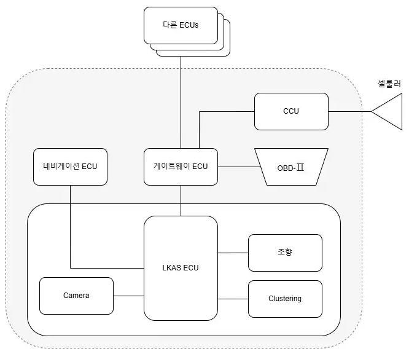

# Mobility Project 3

Vehicle Cybersecurity Threat Analysis (LKAS)

## Objective

ISO/SAE 21434 표준을 기반으로 LKAS(Lane Keeping Assist System)의
사이버보안 위협 분석(TARA)을 수행하고, 주요 자산·위협·리스크를 체계적으로 도출함.

본 프로젝트는 일정 제약으로 인해 보안 기능 구현 단계는 제외하고
취약점 분석 및 리스크 평가까지 수행함.

## System Overview

시스템 아키텍처

- Target System: LKAS (Lane Keeping Assist System)

- ASIL Level: ASIL B

- Vehicle Scope: Passenger car / SUV (Level 2 ADAS)

- Core Components: 
  - Front Camera
  - LKAS ECU
  - Steering Actuator(EPS)
  - Gateway ECU
  - CCU(OTA/V2X)
  - CAN-FD
  - Automotive Ethernet

## Scope of Work

- Item Definition 및 시스템 경계 정의

- 핵심 자산 식별 (Sensor, ECU, Network, Software)

- 위협 시나리오 식별 (총 15개)

- 영향도 및 공격 가능성 평가

- 리스크 우선순위 결정

- 사이버보안 목표 및 보안 컨셉 도출

## Key Threats Identified

- Camera spoofing 및 GNSS spoofing

- CAN 메시지 도청·재생 및 네트워크 DoS

- Gateway 보안 정책 우회

- LKAS ECU 제어 명령 변조

- 펌웨어 및 내부 알고리즘 변조 (OTA/OBD-II)

- 운전자 경고(HMI) 무력화

다수의 위협이 차량 조향 오작동으로 직결될 수 있는 Severe 수준의 Safety Impact로 평가됨 

## Risk Assessment Summary

- Very High Risk: ECU 펌웨어 변조, 원격 명령 실행, 조향 명령 권한 우회

- High Risk: 센서 스푸핑, CAN 재생 공격, 네트워크 DoS, 경고 알림 차단

## Cybersecurity Concept

- Defense in Depth 및 Zero Trust 원칙 적용

- CAN/Ethernet 메시지 인증 및 재생 방지

- ECU 부팅·런타임 무결성 검증

- Gateway 기반 트래픽 필터링

- OTA 및 원격 접근 보안 강화

## Key Takeaways

- LKAS는 기능 안전과 사이버보안이 강하게 결합된 고위험 ADAS 시스템

- 센서, 네트워크, ECU, HMI 전반에 걸친 공격 표면 존재

- ISO/SAE 21434 기반 TARA 절차를 실제 시스템에 적용한 경험 확보

## Keywords

LKAS, ADAS, Automotive Cybersecurity, ISO/SAE 21434, TARA, CAN-FD, OTA, V2X